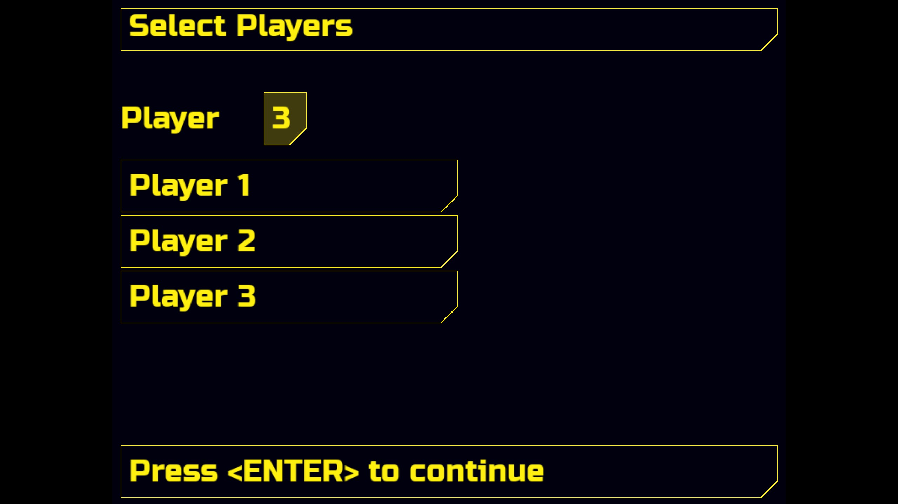
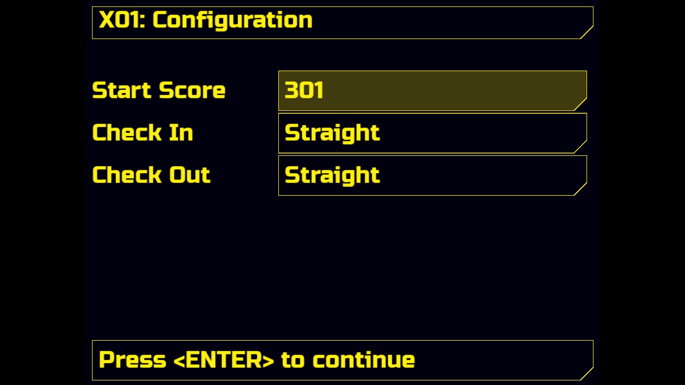
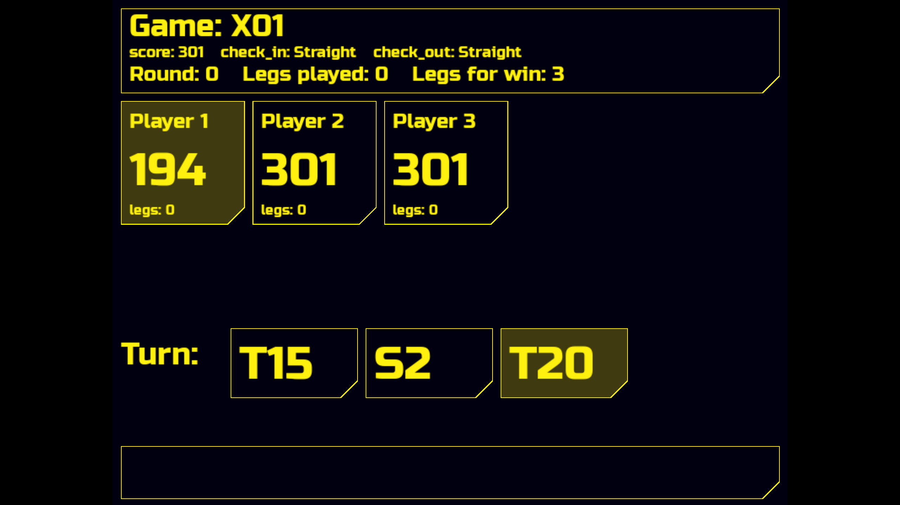

# Dartosphere
A very lightweight desktop application of a darts scoreboard with a UI style
inspired by Cyberpunk 2077.

For controlling Dartosphere, you need only the numpad of your keyboard; no other
keys and no mouse are required. The idea behind this is that the operator can
fully focus his eyes on the dartboard and register hits without needing to look
at the screen or keyboard. The fingers know their position on the numpad, and
with the integrated voice output, the typed‑in score can be immediately checked
by hearing.

# Features
- Up to 5 Players
- Darts Caller (Voice output of hit scores)
- Supported Game Modes
	- X01 (301, 501 and 701)
	- Gotcha!

## Soundfiles
The soundfiles for the darts caller were created with
[https://speechgen.io/de/](https://speechgen.io/de/).

The used settings were:
- Englisch (USA)
- Speaker Angel
- Pitch (normal)
- Speed x1.8
